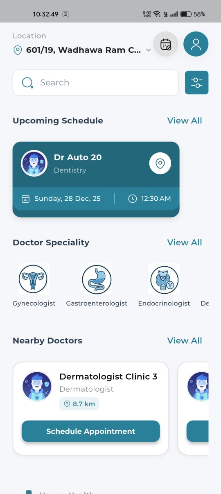
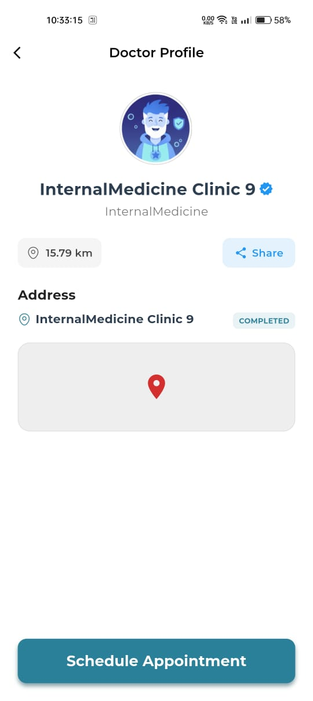
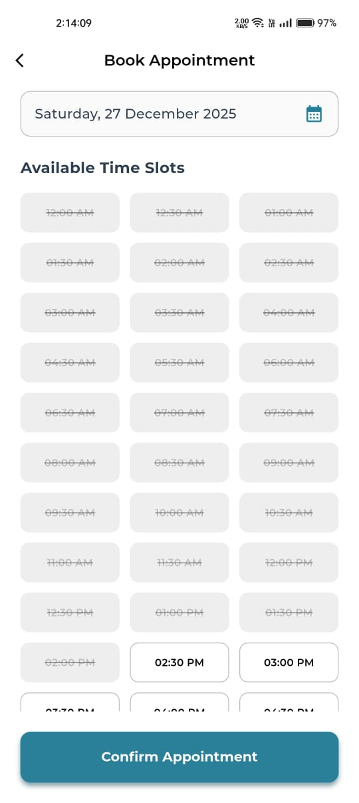
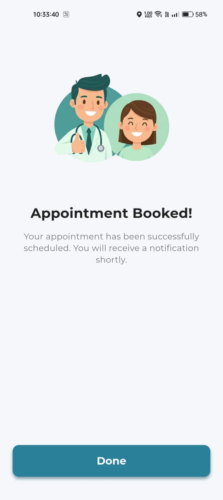
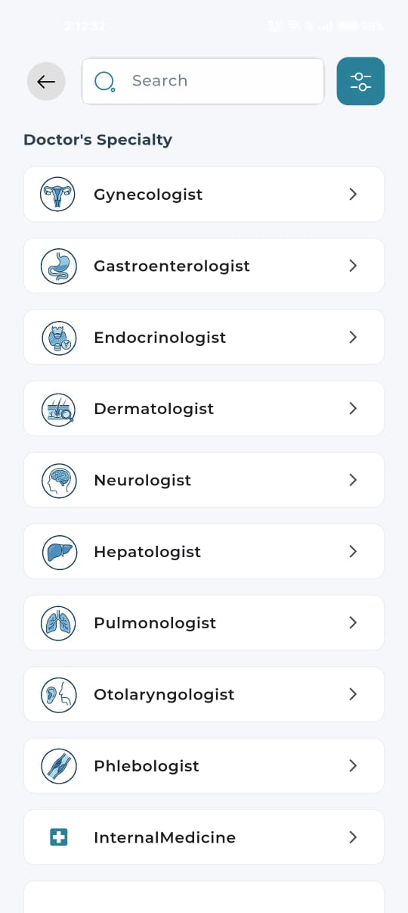

# Veersa Health 🏥  
### Team Name: HackHeroes

> **Hackathon Track:** Veersa Hackathon 2026   
> **Role:** Frontend Engineering & UI/UX   
> **Status:** ✅ Completed

---

## 📖 Project Overview
**Veersa Health** is a digital healthcare solution designed to bridge the gap between patients and doctors. In an era where digital presence is mandatory, this application allows users to find specialists, view them based on **real-time geolocation** (shortest distance), and book conflict-free appointments with smart reminders.

### 🎥 [Watch the Demo Video Here](https://drive.google.com/file/d/1mLfcZNTHX90YadbyT_h3lnuGKhd7zJ1z/view?usp=drivesdk)
### 🎨 [View Figma Design](https://www.figma.com/design/ykM3eqSVtzxpgv6Ifvcg8s/Frontend-Design?node-id=0-1&t=WaX7DikWjOXV0wSd-1)

---

## ⬇️ Download & Test
Judges can install the application directly on an Android device to test the geolocation and notification features.

### [📲 Download Android APK (v1.0)](https://github.com/nktanwar/HackHeros/releases/download/v1.0/app-release.apk)
*(Note: Please allow installation from unknown sources if prompted)*

---

## ✨ Key Features (Problem Statement Solutions)
We successfully implemented all 5 core requirements from the problem statement:

1.  **🔍 Specialty Search:** Filter doctors by category (Cardiologist, Dentist, etc.) and filter by distance radius.
2.  **📍 Smart Geolocation:** Doctors are automatically sorted by **shortest distance** from the user's current location using `geolocator`.
3.  **📅 Seamless Booking:** Users can book slots with instant in-app confirmation.
4.  **🛡️ Conflict Protection:** Logic to prevent double-booking of the same doctor slot.
5.  **🔔 Smart Reminders:** Push notifications sent 1 hour prior with **driving directions** launched via `url_launcher`.

---

## 🛠️ Tech Stack
* **Framework:** Flutter (Dart)
* **State Management:** **GetX** (Chosen for lightweight context-free navigation and reactive state).
* **Location Services:** * `geolocator`: To fetch the user's precise real-time coordinates.
    * `geocoding`: To translate coordinates into readable addresses (e.g., "Paniyala").
* **Utility:** `url_launcher` (For opening Google Maps driving directions and external links).
* **Design Tool:** Figma
* **Testing:** Manual Testing Strategy

---

## 📱 Screenshots

| Home Screen | Doctor Profile | Schedule Appointment | Booking Success | Search Screen |
|:---:|:---:|:---:|:---:|:---:|
|  |  |  |  |  |

---

## 🚀 How to Run the App
To set up this project locally for evaluation:

1.  **Clone the repository:**
    ```bash
    git clone [https://github.com/nktanwar/HackHeros.git](https://github.com/nktanwar/HackHeros.git)
    ```
2.  **Navigate to the project directory:**
    ```bash
    cd veersa_health_app
    ```
3.  **Install Dependencies:**
    ```bash
    flutter pub get
    ```
4.  **Run on Emulator/Device:**
    ```bash
    flutter run
    ```

---

## 📂 Deliverables & Documentation
Per the hackathon guidelines, all required documents are attached below:

* 📄 **[Quality Assurance & Test Report](./QA_Testing_Report.md)** (Contains Manual Test Cases & Bug Report)
* 🎨 **[Design Architecture](./DESIGN.md)** (Figma Links & User Flow)
* 📹 **[Presentation Video](https://drive.google.com/file/d/1mLfcZNTHX90YadbyT_h3lnuGKhd7zJ1z/view?usp=drivesdk)**
* 📹 **[Presentation Video](https://drive.google.com/file/d/11jvxpigae9cd2t-mryzytgxk9YGjgUh8/view?usp=drive_link)**

---

## 💡 Challenges & Learning

During development, we encountered and solved several complex issues:
1.  **Backend DTO Mismatch:** We faced `Status 500` errors due to Snake_case vs Camel_case JSON conflicts. **Solution:** Refactored the Flutter User Model to align perfectly with the backend schema.
2.  **Android 13+ Notifications:** Notifications were failing initially. **Solution:** Implemented specific permission requests for `POST_NOTIFICATIONS` on newer Android APIs.
3.  **Maps Integration:** Handling external map launching (`url_launcher`) required specific URI scheme formatting to pass coordinates correctly.

---

## 👨‍💻 Contributors
* **Sachin** - UI/UX Design, Frontend Development
* **Shashikant** - Integration, Frontend Development, QA Testing
* **Pankaj** - Backend Development & System Design

---
*Submitted for Veersa Hackathon 2026*