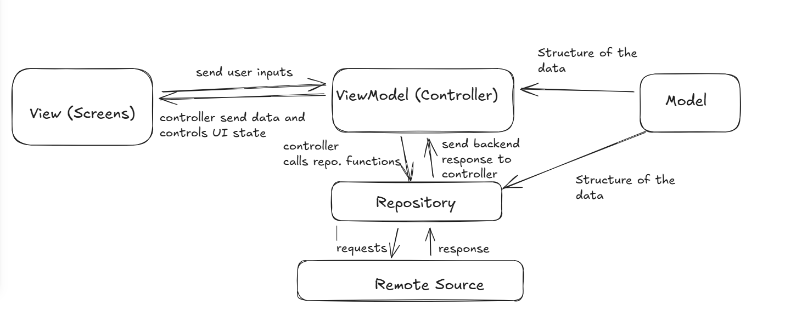

# 🎨 Design & Information Architecture
**TeamName** HackHeroes
**Project:** Veersa Health  
**Role:** Frontend Engineering & UI/UX  
**Tech Stack:** Flutter, GetX, Figma  

---

## 🔗 Design Source
**[Click Here to View Live Figma Project](https://www.figma.com/design/ykM3eqSVtzxpgv6Ifvcg8s/Frontend-Design?node-id=0-1&t=WaX7DikWjOXV0wSd-1)** *This link contains the full high-fidelity wireframes, color palette, and clickable prototype.*

---

## 🏗️ Software Architecture (Frontend)
The application is built using a **Feature-Based Clean Architecture** powered by **GetX**. This ensures separation of concerns between the UI (Screens), Business Logic (Controllers), and Data Layer (Repositories).

### 1. Architectural Diagram
The following diagram illustrates the unidirectional data flow adopted in the application:




### 2. Core Modules & Data Flow
We have structured the codebase into modular layers to ensure scalability and testability.

#### 🔐 A. Authentication Module
Handles user session, sign-up, and login validation.
* **View (`LoginScreen`):** Collects user credentials and observes state for loading/error indicators.
* **Controller (`LoginController`):** Manages form validation, calls the repository, and handles navigation routing upon success.
* **Repository (`AuthenticationRepository`):** Performs the actual HTTP requests to the backend (Login/Register APIs) and manages local token storage.

#### 📅 B. Appointment & Scheduling Module
Handles the core booking logic, slot selection, and conflict checking.
* **View (`ScheduleScreen` / `AppointmentScreen`):** Displays the calendar, time grids, and booking confirmation dialogs.
* **Controller (`AppointmentController`):**
    * Fetches available slots.
    * Checks for conflicts (Double-booking logic).
    * Sends booking requests to the repository.
* **Repository (`AppointmentRepository`):** Communicates with the booking endpoints and fetches historical appointment data.

#### 🏥 C. Discovery & Home Module
Handles geolocation, doctor listing, and search.
* **View (`HomeScreen` / `DoctorScreen`):** Displays the dashboard, categories, and sorted doctor lists.
* **Logic (GetX):** Sorts the doctor list based on the user's live geolocation coordinates calculated via `geolocator`.

---

## 🗺️ Information Architecture (IA)
The user flow is designed to minimize clicks to reach the "Book Appointment" goal.

```mermaid
graph TD;
    A[Launch App] --> B[LoginScreen];
    B --> |Success| C[HomeScreen];
    
    C --> |Search/Filter| D[DoctorScreen];
    D --> |Select Doctor| E[ScheduleScreen];
    
    E --> |Select Date & Time| F[AppointmentController];
    F --> |Conflict Check Passed| G[AppointmentScreen / Confirmation];
    
    C --> |View History| H[My Appointments];